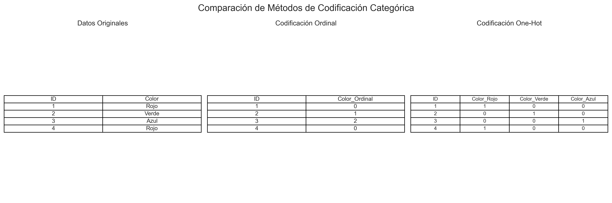
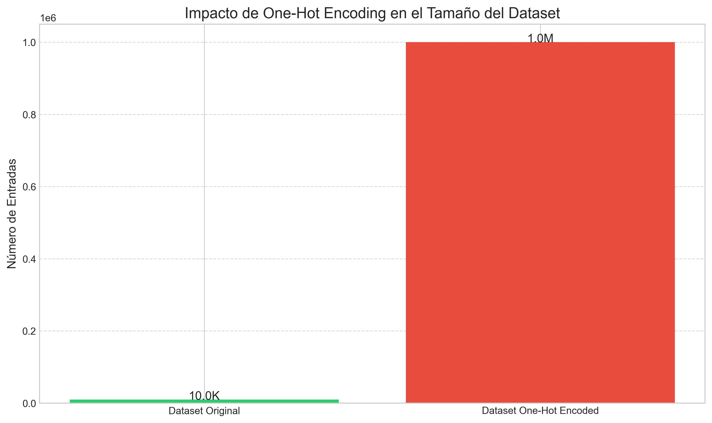

# 🔍 Codificación de Variables Categóricas para Machine Learning

Este repositorio contiene herramientas y explicaciones para el manejo de variables categóricas en proyectos de machine learning, demostrando la importancia de elegir el enfoque de codificación adecuado según la cardinalidad de las variables.

## 📋 Contenido

- Identificación de columnas seguras para codificación
- Análisis de cardinalidad de variables categóricas
- Implementación de codificación ordinal y one-hot
- Visualización del impacto de cada técnica
- Demostración del crecimiento del dataset con columnas de alta cardinalidad

## 🧠 Conceptos Clave

### Codificación Ordinal vs One-Hot



### Impacto en el Tamaño del Dataset

Con un dataset de 10,000 filas y una columna categórica con 100 valores únicos:
- **Columna original**: 10,000 entradas
- **Después de one-hot encoding**: 1,000,000 entradas
- **Entradas añadidas**: 990,000



## 🛠️ Requisitos

```
pandas
numpy
matplotlib
seaborn
scikit-learn
```

## 📦 Instalación

```bash
git clone https://github.com/tuusuario/categorical-encoding.git
cd categorical-encoding
pip install -r requirements.txt
```

## 🚀 Uso

Ejecuta el script principal para ver la demostración completa:

```bash
python categorical_encoding.py
```

## 🔍 Estrategia Recomendada

1. **Identificar columnas inseguras**: Detectar columnas que tienen valores en validación que no aparecen en entrenamiento
2. **Analizar cardinalidad**: Contar el número de valores únicos en cada columna categórica
3. **Aplicar codificación selectiva**:
   - One-hot encoding para columnas con baja cardinalidad (<10-15 valores únicos)
   - Ordinal encoding o descarte para columnas con alta cardinalidad

## 📊 Ejemplo de Análisis de Cardinalidad

```python
# Identificar columnas categóricas
object_cols = [col for col in X_train.columns if X_train[col].dtype == "object"]

# Analizar cardinalidad
object_nunique = list(map(lambda col: X_train[col].nunique(), object_cols))
d = dict(zip(object_cols, object_nunique))
sorted(d.items(), key=lambda x: x[1])  # Ordenar por número de valores únicos
```

## 🔎 Identificación de Columnas Seguras

```python
# Identificar columnas categóricas seguras para codificación
good_label_cols = [col for col in object_cols if 
                   set(X_valid[col]).issubset(set(X_train[col]))]

# Columnas problemáticas con valores nuevos en validación
bad_label_cols = list(set(object_cols)-set(good_label_cols))
```

## 📝 Autor

Ronald Vilcas

